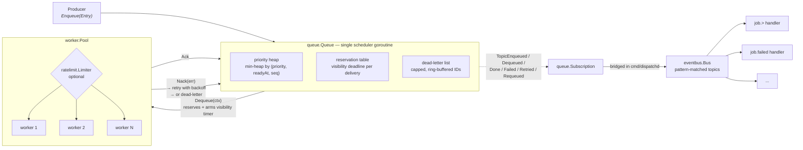

# dispatch

A job dispatch engine in pure Go: a priority queue with SQS-style delivery
semantics, a bounded worker pool, a composable rate limiter, and a topic-routed
event bus.

**Zero external dependencies.** Everything — including every test — is built on
the standard library. There is no `go.sum`.

```
git clone https://github.com/Inc-cryp/dispatch
cd dispatch
go test -race ./...
go run ./cmd/dispatchd -subjects 2000
```

Then in another shell:

```
curl localhost:8080/healthz
curl -s localhost:8080/stats | python3 -m json.tool
```

---

## Why this exists

Job queues are one of those things that look trivial until they are not. The
interesting part is not "put a struct in a channel" — it is everything that
happens when a worker dies mid-job, when a downstream service rate-limits you,
when the process receives `SIGTERM` with 400 jobs in flight, and when a caller
polling for shutdown accidentally holds a lock that blocks every producer.

This is a portfolio-scale implementation of that problem, written to be read.
Each package is standalone, independently testable, and free of background
goroutines you did not ask for.

### What is honest about this design

It is a **single-node, in-memory** queue. It does not claim otherwise. The
durable, distributed version is a different program: it needs a replicated log,
fencing tokens, and idempotent consumers. What this repo demonstrates is the
*semantics and the concurrency machinery* — at-least-once delivery, visibility
timeouts, exponential backoff, dead-lettering, backpressure, graceful drain —
behind interfaces narrow enough that an SQS or Redis or Postgres backend can be
swapped in without touching the worker pool.

---

## Architecture



The dependency graph is strictly layered, with no cycles:

| Package | Imports (internal) | Role |
| --- | --- | --- |
| `queue` | — | Durable-ish job storage, delivery semantics, retries |
| `ratelimit` | — | Token bucket, fixed window, `Multi`, per-key `Keyed` |
| `eventbus` | — | Topic-pattern pub/sub with per-subscriber drop policies |
| `worker` | `queue`, `ratelimit` | Bounded pool; calls the `Sink` interface |
| `cmd/dispatchd` | all four | Wiring, HTTP health/stats, signal handling |

`queue`, `ratelimit`, and `eventbus` know nothing about each other. `worker`
never imports `eventbus` — the bridge between the queue's event stream and the
bus lives in `cmd/dispatchd`, so neither package grows a dependency it does not
need.

---

## Design decisions worth defending

These are the choices a reviewer would actually question. Each one is a trade-off,
not an accident.

### The queue owns exactly one goroutine

`queue.New` starts a single scheduler goroutine. It is the only thing that mutates
delayed-delivery and visibility state. Producers and consumers take a mutex to
touch the heap, but *time* belongs to the scheduler alone.

The alternative — a `time.AfterFunc` per job — does not survive contact with a
million jobs. It also makes shutdown non-deterministic: there is no way to know
when all pending timers have fired. One goroutine with a `time.Timer` that gets
reset to the next deadline is predictable, cheap, and trivially drainable.

`Queue.Close()` is idempotent and concurrency-safe; it stops the scheduler, drains
its event fan-out, and marks the queue closed. Enqueueing after that returns
`ErrClosed` rather than panicking.

### Visibility timeout instead of a lock held across the handler

`Dequeue` does not hand out a job and forget it. It records a reservation with a
deadline and arms the scheduler. The worker must `Ack` (done) or `Nack` (retry or
dead-letter) before that deadline. If the process is killed, the reservation
simply lapses and the job becomes ready again — which is what makes delivery
at-least-once rather than at-most-once.

A lapsed reservation deliberately **does not** consume an attempt. A worker that
was OOM-killed did not fail the job; punishing the job for infrastructure failure
would silently burn through `MaxAttempts` during a crash loop.

### Priorities are (priority, readyAt, sequence) — and the sentinel matters

An immediate job is normalized to a zero `RunAt`, not `time.Now()`. This was a
real bug: when every entry carried its own `time.Now()`, that timestamp was the
second sort key, so it always decided the ordering and the priority field was
dead code. Normalizing to the zero time lets priority and insertion order decide,
and only *delayed* jobs are ordered by wall clock.

### `DefaultBackoff` applies the cap after the jitter

```go
delay := base * (1 << (attempt - 1))   // exponential
delay += jitter(delay)                 // decorrelate retries
if delay > cap { delay = cap }         // cap LAST
```

Capping before adding jitter means the cap can be exceeded, which defeats the
point of a cap. This was also a real bug found by the test suite.

### `Publish` is synchronous fan-out; handlers are asynchronous

`eventbus.Publish` matches subscriptions and delivers to each subscriber's
buffered channel *before returning*. Handler execution is off the publisher's
goroutine. This gives the publisher a bounded, honest cost: one channel send per
matching subscriber.

But it means something important: a full subscriber buffer must never be able to
block the publisher. When the buffer is full, the subscriber's `DropPolicy`
decides:

- `DropNewest` (default) — the publisher never blocks; the event is dropped and
  counted on `Subscription.Dropped()`. **A slow subscriber cannot slow you down.**
- `Block` — the publisher waits for room, bounded by the context.

The default is `DropNewest` precisely because the failure mode of `Block` is a
slow consumer mysteriously stalling unrelated producers. Dropping is loud
(`Dropped()` is a counter, not a log line) and local.

### `matching()` releases the bus lock before delivering

Under `Block`, a channel send can wait indefinitely. Holding the bus lock across
that send would let one slow subscriber stall *every* publisher on the bus. So the
batch of matching subscribers is collected under the lock, and the lock is
released before any send happens.

### Rate limiters have no background goroutines

A token bucket refills lazily: each call computes elapsed time and adds the
corresponding tokens. No goroutine, no timer per limiter, cost proportional to
actual use.

Every limiter takes an injected clock (`WithClock`). Tests advance time explicitly
instead of sleeping, which is why the test suite runs in seconds instead of
minutes and is not flaky.

### `Keyed` deliberately does **not** implement `Limiter`

`TokenBucket`, `FixedWindow`, and `Multi` are `Limiter`s — they take no key.
`Keyed` requires one, so its methods are `Allow(key)`, `Reserve(key)`,
`Wait(ctx, key)`.

This is a design decision with a test pinning it (`TestKeyedIsNotALimiter`). The
temptation is to add zero-argument stubs so `Keyed` satisfies `Limiter` and can be
passed anywhere. But a `Wait` stub that returns `nil` makes an unkeyed caller fail
**open** — it would silently never throttle anything. Making the signatures
incompatible turns a silent production bug into a compile error.

### `Wait` checks the context before consuming a token

`TokenBucket.Wait` on an already-cancelled context returns `ctx.Err()` without
consuming capacity. This was a fail-open bug found by the verification pass: the
loop only checked `ctx.Err()` on the sleep path, so the first iteration would
consume a token and then report success on a dead context. Both `Wait`
implementations now check at the top of every iteration and again after granting.

### The worker pool splits its contexts in two

`Pool.Start(ctx)` derives a *dispatch* context (cancellable, gates `Dequeue` and
limiter waits) but passes the caller's original `ctx` to handlers. Graceful
`Shutdown` cancels only the dispatch context, so in-flight jobs run to completion
instead of being cancelled out from under the handler.

`Shutdown(ctx)` then drains: it stops dequeueing, waits for in-flight jobs up to
`DrainTimeout`, and on expiry returns an error wrapping `context.DeadlineExceeded`
with the number of jobs still in flight. It is idempotent — calling it twice is
safe and the second call returns immediately.

### `worker.New` panics on a nil sink or nil handler

A nil handler used to be silently replaced with a no-op, which means every job
succeeds while doing nothing: silent, total data loss. Programming errors at
construction time should be loud. `New` panics with an explicit message; a
`Start(nil)` context returns `ErrNilContext` rather than panicking inside
`context.WithCancel`.

### Errors are values, and they are wrapped

Sentinels (`queue.ErrClosed`, `worker.ErrAlreadyStarted`,
`ratelimit`-free by design, `eventbus.ErrBusClosed`, ...) are checked with
`errors.Is`. Wrapped errors use `%w`. A panicking handler is reported as
`ErrHandlerPanic` wrapped with the job ID, so a buggy handler is distinguishable
from a job that legitimately failed downstream.

### Interfaces are defined where they are consumed

`worker.Sink` is the four-method subset of `*queue.Queue` the pool actually needs
(`Dequeue`, `Ack`, `Nack`, `Extend`). `cmd/dispatchd` passes the real queue; tests
pass a scriptable fake. This is the Go proverb made concrete: the consumer
declares the interface, so the pool can be tested without a queue at all.

### The pool runs an explicit set of goroutines

`Start` launches a fixed number of worker goroutines (`WithWorkers`) plus a
dispatcher that calls `Dequeue` and hands each delivery to a free worker over a
buffered channel. Workers never touch a reservation directly — they report the
outcome and the release path acks or nacks. Keeping the number of goroutines that
call into the queue small and bounded is what makes the queue's own locking
predictable.

`InFlight()` and `Stats()` are served from atomics and a channel length, so
observing a running pool never blocks it.

---

## Benchmarks

Measured, not estimated. Every number below comes from
`go test -bench . -benchtime 100ms` on an **Apple M1 (8 cores), go1.26.0,
darwin/arm64**. Reproduce with:

```
go test -run XXX -bench . -benchtime 100ms ./...
```

### `queue`

| Benchmark | ns/op | B/op | allocs/op |
| --- | ---: | ---: | ---: |
| `Enqueue` | 411.8 | 289 | 4 |
| `EnqueueParallel` | 575.0 | — | — |
| `EnqueueDequeueAck` (full lifecycle) | 562.4 | 0 | 0 |
| `DequeuePriority` | 1030 | 0 | 0 |
| `DequeueParallel` | 751.5 | 0 | — |
| `SubscribeFanout/subscribers=1` | 609.0 | 278 | 3 |
| `SubscribeFanout/subscribers=4` | 1047 | 311 | 3 |
| `SubscribeFanout/subscribers=16` | 1357 | 407 | 4 |

The zero-allocation steady state is the point: after `Enqueue` allocates the
entry, the dequeue/ack cycle recycles and allocates nothing.

### `eventbus`

| Benchmark | ns/op | B/op | allocs/op |
| --- | ---: | ---: | ---: |
| `Publish` | 245.7 | 80 | 3 |
| `PublishParallel` | 247.4 | 56 | 3 |
| `PublishNoMatch` | 290.2 | 223 | 7 |
| `PublishSync` | 155.3 | 79 | 3 |
| `HandlerThroughput` (end-to-end) | 364.7 | 79 | 3 |
| `PublishDropNewest` (overflow path) | 150.3 | 79 | 3 |
| `MatchTopic/job.created` | 69.08 | 64 | 2 |
| `MatchTopic/job.*` | 66.51 | 64 | 2 |
| `MatchTopic/job.>` | 66.38 | 64 | 2 |
| `MatchTopic/>` | 55.70 | 48 | 2 |
| `SubscribeFanout/subscribers=1` | 255.0 | 79 | 3 |
| `SubscribeFanout/subscribers=8` | 1925 | 583 | 17 |
| `SubscribeFanout/subscribers=32` | 6417 | 2311 | 65 |

Two things stand out. The overflow path (150 ns/op) is *cheaper* than the
delivery path (246 ns/op), which is exactly what `DropNewest` should look like —
admission control is doing its job. And fan-out is linear: ~200 ns per
subscriber, so broadcast cost is predictable rather than quadratic.

### `ratelimit`

| Benchmark | ns/op | B/op | allocs/op |
| --- | ---: | ---: | ---: |
| `TokenBucketAllow` (denied) | 30.13 | 0 | 0 |
| `TokenBucketAllowGranted` | 39.05 | 0 | 0 |
| `TokenBucketAllowParallel` | 120.9 | 0 | 0 |
| `TokenBucketReserve` | 29.12 | 0 | 0 |
| `FixedWindowAllow` | 29.66 | 0 | 0 |
| `FixedWindowAllowParallel` | 126.6 | 0 | 0 |
| `MultiAllow/limiters=1` | 29.47 | 0 | 0 |
| `MultiAllow/limiters=2` | 37.29 | 0 | 0 |
| `MultiAllow/limiters=4` | 108.1 | 0 | 0 |
| `MultiAllow/limiters=8` | 213.9 | 0 | 0 |
| `KeyedGet` | 17.70 | 0 | 0 |
| `KeyedGetParallel` | 186.2 | 14 | 1 |
| `KeyedEviction` (worst case LRU) | 183.9 | 168 | 5 |
| `WaitImmediate` (fast path) | 72.84 | 0 | 0 |

The whole limiter is allocation-free on its hot paths. Denial is as cheap as
grant, so a limiter that is rejecting traffic is not a liability — which matters,
because the limiter usually runs at its most contended moment when it is
throttling. `KeyedGet` at 17.7 ns is a plain map hit; `KeyedEviction` pays 168 B
for the fresh limiter, which is the honest cost of bounded memory.

### `worker`

| Benchmark | ns/op | B/op | allocs/op |
| --- | ---: | ---: | ---: |
| `PoolThroughput/workers=1` | 479.6 | 0 | 0 |
| `PoolThroughput/workers=4` | 396.3 | 0 | 0 |
| `PoolThroughput/workers=16` | 510.4 | 0 | 0 |
| `PoolWithLimiter` | 502.7 | 0 | 0 |
| `ResultCallback/disabled` | 416.5 | 0 | 0 |
| `ResultCallback/enabled` | 499.3 | 0 | 0 |
| `PoolStartShutdown` | 4709 | 3089 | 25 |

Worth being honest about the shape here: throughput is ~400–500 ns/job and
**does not improve past 4 workers** on an 8-core M1. That is the benchmark
sink (a single buffered channel) becoming the bottleneck, not the pool — the
measured value is scheduling overhead plus channel handoff, so it is a floor,
not a ceiling. The no-op handler costs nothing, which is the intended signal.

`PoolStartShutdown` at 4.7 µs / 25 allocs tells you a short-lived pool is cheap
enough to create per-test or per-request-batch.

---

## What the tests cover

```
$ go test -race -count=1 ./...
ok  github.com/Inc-cryp/dispatch/cmd/dispatchd
ok  github.com/Inc-cryp/dispatch/eventbus
ok  github.com/Inc-cryp/dispatch/queue
ok  github.com/Inc-cryp/dispatch/ratelimit
ok  github.com/Inc-cryp/dispatch/worker
```

Every package runs under `-race`. Beyond the feature tests, each package has a
`leak_test.go` that snapshots `runtime.NumGoroutine()`, churns the package's
resources (queue close, bus subscribe/close cycles, pool start/shutdown, limiter
key churn), and then asserts the count returns to the baseline — retrying for up
to 5 seconds and dumping the full `runtime.Stack` on failure. Leaked goroutines
are the failure mode that only shows up in production months later, so they get
an explicit test rather than a comment.

Some specific behaviours pinned by tests:

- `TestWaitWithAlreadyCancelledContextDoesNotConsume` — the fail-open regression.
- `TestKeyedIsNotALimiter` — the type-system choice above.
- Priority ordering vs. FIFO for equal priorities, including delayed jobs.
- A lapsed reservation does not consume an attempt.
- `Nack` returns `ErrRetryScheduled` when it will retry, `ErrJobFailed` when it
  dead-letters.
- `Shutdown` on an already-stopped pool, and `Close` called twice on every type.
- Panicking handlers become `ErrHandlerPanic` instead of killing the pool.
- `Publish` under `Block` policy unblocks when the bus closes.

---

## Project layout

```
dispatch/
├── cmd/dispatchd/        demo service: wiring, HTTP, signal handling
├── docs/DESIGN.md        deep design notes and trade-off narrative
├── eventbus/             topic-pattern pub/sub
├── queue/                priority queue + delivery semantics
├── ratelimit/            token bucket, fixed window, Multi, Keyed
└── worker/               bounded worker pool + graceful drain
```

The README is the tour; [`docs/DESIGN.md`](docs/DESIGN.md) is the deep end —
invariants, the failure taxonomy, the bugs the tests caught, and what a durable
backend would have to change.

Total: ~6,700 lines including tests, across 27 files.

### `dispatchd` flags

| Flag | Default | Meaning |
| --- | --- | --- |
| `-workers` | `8` | Concurrent job runners |
| `-rate` | `200` | Max job starts/sec (`0` disables the limiter) |
| `-burst` | `50` | Limiter burst capacity |
| `-addr` | `:8080` | HTTP listen address |
| `-subjects` | `2000` | Jobs to generate at startup |
| `-shutdown-timeout` | `10s` | Graceful drain deadline |
| `-log-level` | `info` | `debug`, `info`, `warn`, `error` |
| `-healthcheck` | _(off)_ | Probe this URL and exit 0/1 instead of serving |

`-healthcheck` exists because the container image is `FROM scratch` and contains
no `curl` or `wget` to shell out to. The binary probes itself instead:

```
$ dispatchd -healthcheck=http://127.0.0.1:8080/healthz && echo alive
alive
```

The demo generates four job kinds — `email.send`, `image.resize`, `slow.index`,
and `flaky.report` (which fails intermittently, to exercise the retry and
dead-letter paths). Every queue transition is bridged onto the event bus and
logged.

Shutdown order is deliberate: stop the HTTP listener, then drain the pool so no
job is cut off mid-flight, then close the bus **last** so the final state
transitions still get published.

---

## Roadmap

The interfaces are the interesting part; these are the backends they were shaped
for.

- [ ] **`queue.Backend`**: extract storage behind an interface and add a Redis
      implementation (delayed set + lock-based reservations) and a Postgres one
      (`FOR UPDATE SKIP LOCKED` + `LISTEN/NOTIFY`).
- [ ] **Idempotency keys** so an at-least-once consumer can deduplicate retries.
- [ ] **Fair scheduling**: per-tenant queues with weighted round-robin instead of
      one global priority heap.
- [ ] **Adaptive visibility timeouts**: extend a reservation automatically when a
      handler reports progress, instead of relying on a fixed `Extend`.
- [ ] **Structured tracing**: propagate `traceparent` through `Entry.Payload`
      metadata so a job's retries appear as one trace.
- [ ] **Prometheus metrics exporter** for the counters `Stats()` already exposes.
